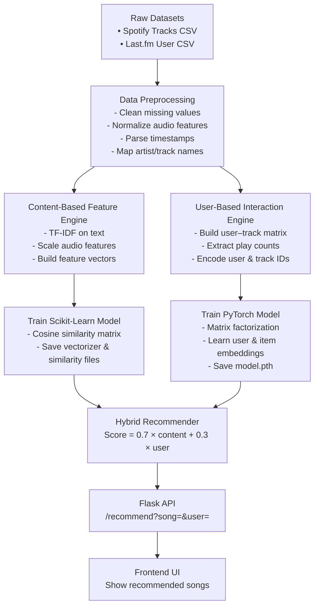

```mermaid
flowchart TD

    A[Raw Datasets<br/>• Spotify Tracks CSV<br/>• Last.fm User CSV] --> B[Data Preprocessing<br/>- Clean missing values<br/>- Normalize audio features<br/>- Parse timestamps<br/>- Map artist/track names]

    B --> C[Content-Based Feature Engine<br/>- TF-IDF on text<br/>- Scale audio features<br/>- Build feature vectors]
    B --> D[User-Based Interaction Engine<br/>- Build user–track matrix<br/>- Extract play counts<br/>- Encode user & track IDs]

    C --> E[Train Scikit-Learn Model<br/>- Cosine similarity matrix<br/>- Save vectorizer & similarity files]
    D --> F[Train PyTorch Model<br/>- Matrix factorization<br/>- Learn user & item embeddings<br/>- Save model.pth]

    E --> G[Hybrid Recommender<br/>Score = 0.7 × content + 0.3 × user]
    F --> G

    G --> H[Flask API<br/>/recommend?song=&user=]
    H --> I[Frontend UI<br/>Show recommended songs]
```
